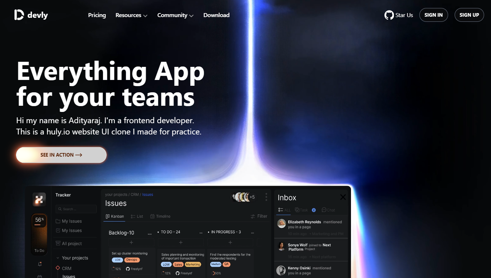

# Huly.io UI Clone

A responsive UI clone of the Huly.io website built using React , Tailwind CSS and framer, focusing on layout accuracy, modern animations, and clean component structure.

## Live Demo
🔗 https://your-demo-link.vercel.app

## Screenshots


## Features
- Pixel-accurate UI recreation of Huly.io
- Fully responsive design (desktop, tablet, mobile)
- Modern layout with Tailwind utility classes
- Reusable React components
- Smooth hover and transition effects

## Tech Stack
- React
- Tailwind CSS
- JavaScript (ES6+)
- Vite

## Purpose of This Project
This project was built to practice:
- Translating real-world designs into code
- Component-based UI architecture in React
- Tailwind CSS layouts
- Learning Responsive design

## Installation

```bash
git clone https://github.com/Adityarajbind/huly-clone.git
cd huly-clone
npm install
npm run dev
